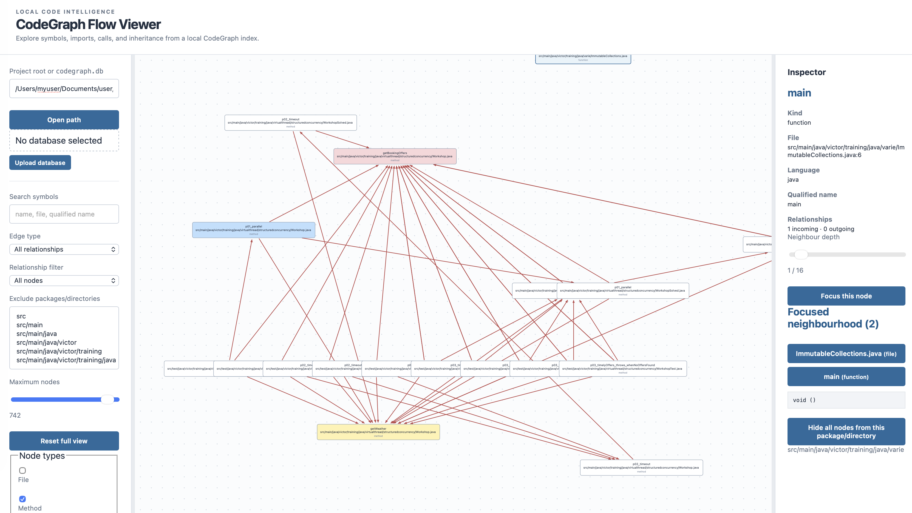

# CodeGraph Flow Viewer

A small web app for exploring a [CodeGraph](https://github.com/colbymchenry/codegraph) database as an interactive graph. Enables you to deeply understand the entities and relationships within a [Codegraph]([CodeGraph](https://github.com/colbymchenry/codegraph))-indexed code source.



## Alternatives:

- JetBrains's built-in code visualizer functionality
- VSCode's `Atomic Viz`

## Prerequisites

- Node.js 22.12 or newer (required by Vite 8 and the built-in `node:sqlite` module)
- A [CodeGraph]([CodeGraph](https://github.com/colbymchenry/codegraph)) project containing `.codegraph/codegraph.db`, or a copied `codegraph.db`
- A modern browser

## Run

```bash
npm install
npm run dev
```

Open [http://localhost:5173](http://localhost:5173), then enter a project/database path or upload a database file.

For a production build:

```bash
npm run build
npm start
```

## Features

- Load a project which initializes [CodeGraph]([CodeGraph](https://github.com/colbymchenry/codegraph)) or a [CodeGraph]([CodeGraph](https://github.com/colbymchenry/codegraph)) database file.
- Explore nodes and relationships on an interactive SVG canvas.
- Drag nodes, pan, zoom, focus neighbors, and reset the full view.
- Inspect node details in the right sidebar.
- Choose neighbor depth per focused node; depth `1` shows direct neighbors.
- Search symbols, files, and qualified names.
- Filter relationship types such as `calls`, `contains`, `references`, etc.
- Show connected nodes only, or hide isolated nodes.
- Filter by node type, including files, methods, fields, namespaces, imports, classes, types, variables, and properties.
    - Currently, methods work the best.
- Include or hide external and generated code, including common Lombok patterns.
- Hide selected packages or directories.
- Limit the number of visible nodes.
- Show the full package/file path or only the file name.
- Assign colors to nodes or remove nodes from the canvas.
- Export and import the complete view and app state as JSON.
- Save the path and view settings across reloads.
- Resize the filter and inspector sidebars.

## Current limitations

- Colossal codebases impede a swift UI experience
- The app has only been tested with a handful of programming languages, not every language supported by [CodeGraph]([CodeGraph](https://github.com/colbymchenry/codegraph)).
    - It currently works best with popular imperative programming languages.
- `calls` relationships and `method` nodes are the most useful and reliable. Other relationship types may behave inconsistently/incorrectly.
- Support for all programming languages is still planned.
- The server is temporary. The app is planned to become a browser-only client in the future.

## Sharing a view

- View/app state can be imported and exported.
- Exported views contain the full database/project path.
- To share a view, the recipient must manually update that path to their local [CodeGraph]([CodeGraph](https://github.com/colbymchenry/codegraph)) database or project.

## Security

This is intended for local use. Do not expose it to an untrusted network because the server can read paths entered in the app.
